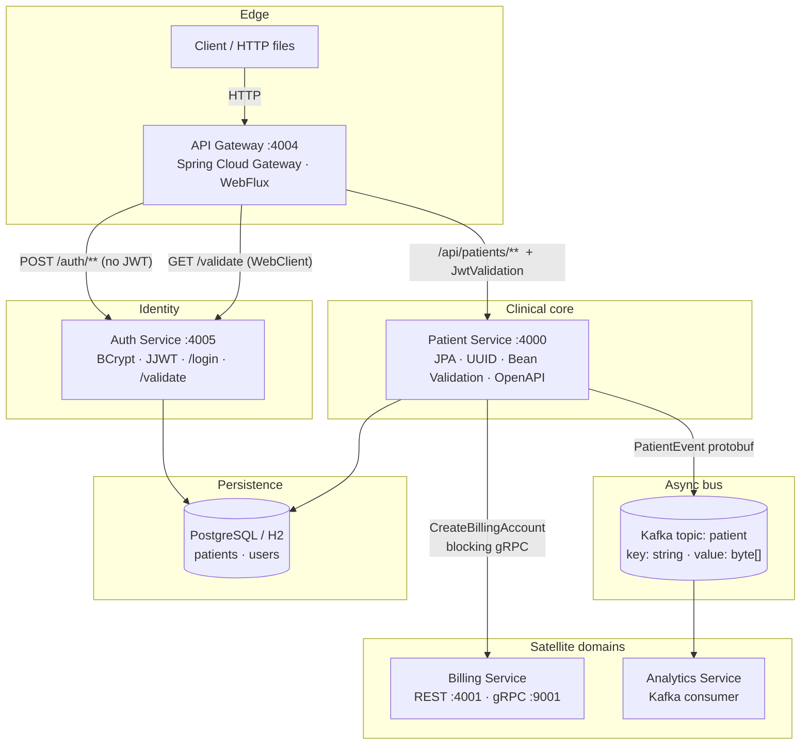

# Distributed Patient Management Platform

A five-service healthcare backend where **patient registration is not a CRUD write**. It is a request that must open a billing account *now*, and a domain event that analytics can consume *later*.

```
REST at the edge → JWT at the gateway → Postgres in the core
                 ↘ gRPC (sync, must succeed)
                 ↘ Kafka (async, may lag)
```

Spring Boot 4 · Spring Cloud Gateway (WebFlux) · gRPC · Kafka · Protobuf · PostgreSQL · Docker

---

## Why this exists

A patient record that is not billable is an incomplete fact. A billing account that blocks analytics is a coupled mess.

This platform splits that problem on purpose:

| Path | Protocol | When it runs | Failure mode |
|------|----------|--------------|--------------|
| **Command** — open a billing account | gRPC, blocking stub | Inside the same HTTP request that creates the patient | Billing down → registration fails. Correct. You do not enroll a patient you cannot charge. |
| **Event** — `PATIENT_CREATED` | Kafka, protobuf bytes on topic `patient` | After persist + billing | Analytics down → patient still exists. Correct. Dashboards can catch up. |

Two clocks. One source of truth (patient-service). Everything else is a consequence.

---

## Topology



Services do not share tables. They share **contracts**: HTTP at the edge, `.proto` between patient ↔ billing, `.proto` on the wire for Kafka.

---

## Service catalog

| Service | Role | HTTP | Other | Speaks |
|---------|------|------|-------|--------|
| **api-gateway** | Single entry. Path routing, prefix strip, JWT gate. | `4004` | — | WebFlux, WebClient |
| **auth-service** | Issue and verify tokens. Users live here, not in the gateway. | `4005` | — | Spring Security, JJWT 0.12, BCrypt |
| **patient-service** | Source of truth for patients. Orchestrates billing + events. | `4000` | Kafka producer | JPA, Validation, springdoc OpenAPI |
| **billing-service** | Billing accounts. Dual stack: REST + gRPC. | `4001` | gRPC `9001` | protobuf, grpc-spring-boot |
| **analytics-service** | Downstream observer. Deserializes `PatientEvent`. | *(consumer)* | Kafka `localhost:9092` | protobuf |

Gateway Docker hostname mapping (container network):

| Public URL | After `StripPrefix` | Upstream |
|------------|---------------------|----------|
| `POST /auth/login` | `/login` | `auth-service:4005` |
| `GET /auth/validate` | `/validate` | `auth-service:4005` |
| `/api/patients/**` | `/patients/**` | `patient-service:4000` |
| `/api-docs/patients` | rewritten → `/v3/api-docs` | `patient-service:4000` |

Patient routes carry the custom filter `JwtValidation`. Auth routes do not — you cannot require a token to obtain a token.

---

## The write path (this is the system)

Creating a patient is the only operation that crosses three process boundaries in one request.

```mermaid
sequenceDiagram
  autonumber
  actor Client
  participant GW as API Gateway :4004
  participant AUTH as Auth :4005
  participant PAT as Patient :4000
  participant BILL as Billing gRPC :9001
  participant KF as Kafka topic "patient"
  participant AN as Analytics

  Client->>GW: POST /auth/login { email, password }
  GW->>AUTH: POST /login
  AUTH->>AUTH: BCrypt match + HMAC JWT (10h, sub=email, claim=role)
  AUTH-->>Client: { token }

  Client->>GW: POST /api/patients  Authorization: Bearer &lt;jwt&gt;
  GW->>GW: reject if header missing or not Bearer
  GW->>AUTH: GET /validate  (same Authorization)
  AUTH-->>GW: 200 or 401
  GW->>PAT: POST /patients  (prefix /api stripped)

  PAT->>PAT: validation groups (create requires registeredDate)
  PAT->>PAT: reject duplicate email
  PAT->>PAT: persist Patient (UUID PK)

  PAT->>BILL: CreateBillingAccount(patientId, name, email)
  BILL-->>PAT: { accountId, status: ACTIVE }

  PAT->>KF: PatientEvent bytes  event_type = PATIENT_CREATED
  KF-->>AN: consume group analytics-service
  AN->>AN: parse protobuf, log identity

  PAT-->>Client: PatientResponseDTO
```

**Order is not accidental.** Persist first (you need an id). gRPC second (billing is on the request path). Kafka third (a failed event must not roll back a patient who already has an account). The producer swallows send errors and logs them — analytics is allowed to miss; billing is not.

---

## Dual-protocol billing

Billing listens on two ports because two kinds of callers exist.

```
:4001  HTTP   — humans, curl, future admin UI
:9001  gRPC   — patient-service, blocking stub, plaintext channel
```

Contract (`billing-service` / `patient-service` share the same proto):

```protobuf
service BillingService {
  rpc CreateBillingAccount(BillingRequest) returns (BillingResponse);
}

message BillingRequest  { string patientId = 1; string name = 2; string email = 3; }
message BillingResponse { string accountId = 1; string status  = 2; }
```

Patient-service builds a `ManagedChannel` to `billing.service.address:billing.service.grpc.port` (defaults `localhost:9001`) and uses a **blocking stub**: the HTTP handler does not return until billing answers. That is the latency you pay to keep the command consistent.

Direct gRPC probe (see `grpc-requests/`):

```
GRPC localhost:9001/BillingService/CreateBillingAccount
```

---

## Event contract

Kafka is not JSON. The payload is a protobuf `PatientEvent` so producer and consumer share a schema, not a hope.

```protobuf
package patient.events;

message PatientEvent {
  string patientId   = 1;
  string name        = 2;
  string email       = 3;
  string event_type  = 4;   // PATIENT_CREATED
}
```

| | |
|--|--|
| Topic | `patient` |
| Key serializer | `StringSerializer` |
| Value | raw `byte[]` (`event.toByteArray()`) |
| Consumer group | `analytics-service` |
| Broker (local) | `localhost:9092` |

Analytics parses with `PatientEvent.parseFrom(event)` and currently logs. The consumer is the extension point: replace the log with a warehouse write without touching patient-service.

---

## Security model

The gateway is not a JWT library. It is a **bouncer that calls the issuer**.

```
request
  └─ Authorization: Bearer …   missing/malformed → 401, never forwarded
  └─ WebClient GET {auth.service.url}/validate
        └─ 200 → chain.filter (proxy to patient-service)
        └─ else → request dies at the edge
```

Implementation: `JwtValidationGatewayFilterFactory` — Spring Cloud Gateway requires the `*GatewayFilterFactory` suffix so the YAML filter name is just `JwtValidation`.

Auth-service itself **permits all HTTP** and disables CSRF. That is intentional: it is not exposed as a public port. The internet talks to `:4004` only. Tokens are HMAC-signed (JJWT, Base64-decoded secret), 10-hour expiry, claims `sub` = email, `role` = `ADMIN` (seed user). Passwords are BCrypt.

Seed account (local):

| | |
|--|--|
| Email | `testuser@test.com` |
| Password | `password123` |
| Role | `ADMIN` |

---

## HTTP surface

Public path = gateway. Direct service ports exist for local debugging; production traffic should not bypass `:4004`.

### Auth (via gateway)

```http
POST http://localhost:4004/auth/login
Content-Type: application/json

{ "email": "testuser@test.com", "password": "password123" }
```

Returns `{ "token": "<jwt>" }`. `401` on bad credentials.

```http
GET http://localhost:4004/auth/validate
Authorization: Bearer <token>
```

### Patients (via gateway — JWT required)

```http
GET    http://localhost:4004/api/patients
POST   http://localhost:4004/api/patients
PUT    http://localhost:4004/api/patients/{uuid}
DELETE http://localhost:4004/api/patients/{uuid}
Authorization: Bearer <token>
```

Create body:

```json
{
  "name": "John Doe",
  "email": "john@example.com",
  "address": "123 Main St",
  "dateOfBirth": "2005-12-07",
  "registeredDate": "2024-11-28"
}
```

Update omits `registeredDate` — Bean Validation **groups** (`CreatePatientValidationGroup`) require it only on create. Duplicate email → `400` with `{ "message": "Email address already exists" }`. Unknown UUID → `{ "message": "Patient Not found" }`. Field errors from `@Valid` return a map of field → message. Delete returns `204`.

Response DTO deliberately drops `registeredDate`. That field is audit data in the table, not API surface.

OpenAPI: `GET http://localhost:4004/api-docs/patients` (gateway rewrites to patient-service `/v3/api-docs`). springdoc UI lives on the patient-service when run standalone.

Ready-made calls: `api-request/auth-service/` and `api-request/patient-service/` (IntelliJ HTTP client; login script stores `token` in the client env).

---

## Data model

**Patient** (UUID PK, unique email)

| Column | Type | Notes |
|--------|------|--------|
| `id` | UUID | Generated, stable across services (passed to billing + Kafka) |
| `name` | VARCHAR | ≤ 100 on the DTO |
| `email` | VARCHAR unique | Duplicate checks on create and update (`existsByEmailAndIdNot`) |
| `address` | VARCHAR | |
| `date_of_birth` | DATE | |
| `registered_date` | DATE | Required on create only |

**User** (auth-service, table `users`)

| Column | Type |
|--------|------|
| `id` | UUID |
| `email` | unique |
| `password` | BCrypt hash |
| `role` | e.g. `ADMIN` |

Seed SQL is idempotent (`WHERE NOT EXISTS`). Patient-service ships a roster of demo patients in `data.sql`.

---

## Repository layout

```
.
├── api-gateway/          edge: routes + JwtValidation filter
├── auth-service/         login, validate, users
├── patient-service/      REST + gRPC client + Kafka producer
├── billing-service/      gRPC server (CreateBillingAccount)
├── analytics-service/    Kafka consumer
├── api-request/          HTTP client scripts (login, CRUD, validate)
├── grpc-requests/        billing RPC probe
└── README.md
```

Each service is its own Maven module with a **multi-stage Dockerfile**: `maven:3.9.9-eclipse-temurin-24` builds the jar, `eclipse-temurin:24-jre` runs it. `mvn dependency:go-offline` in the builder stage so dependency layers cache unless `pom.xml` changes.

There is no shared library jar. Contracts travel as `.proto` files copied into the services that need them.

---

## Run it

You need a Kafka broker on `localhost:9092` before creating patients (producer + consumer). Billing must be up on `:9001` or the create call blocks/fails on gRPC.

```bash
# terminals, one per service
cd auth-service      && ./mvnw spring-boot:run
cd billing-service   && ./mvnw spring-boot:run
cd patient-service   && ./mvnw spring-boot:run
cd analytics-service && ./mvnw spring-boot:run
cd api-gateway       && ./mvnw spring-boot:run
```

Windows: `mvnw.cmd` instead of `./mvnw`.

Order that hurts least: **auth → billing → kafka → patient → analytics → gateway**.

Docker (per service):

```bash
docker build -t patient-service ./patient-service
# ...repeat for auth-service, billing-service, analytics-service, api-gateway
```

In Compose / K8s, set:

| Variable / property | Used by |
|---------------------|---------|
| `billing.service.address` / `billing.service.grpc.port` | patient-service gRPC client |
| `spring.kafka.bootstrap-servers` | patient-service, analytics-service |
| `auth.service.url` | gateway JWT filter |

---

## Design decisions (the parts that are not boilerplate)

**Gateway validates tokens by HTTP, not by sharing the signing key.**  
Auth remains the only component that knows the secret. Cost: an extra hop on every patient request. Gain: rotate keys in one place; gateway stays protocol-only.

**gRPC for billing, Kafka for analytics — not “Kafka for everything”.**  
If billing is an event, you get a patient with no account until some consumer runs. That is a product bug dressed up as decoupling. Events are for work that may be late. RPCs are for work that must be true before the response.

**Protobuf on Kafka, not JSON.**  
Analytics and patient-service cannot silently drift field names. `event_type` is a discriminator so one topic can carry more than `PATIENT_CREATED` later without a new cluster.

**Validation groups instead of two DTOs.**  
Create and update share `PatientRequestDTO`. `registeredDate` is `@NotNull` only on `CreatePatientValidationGroup`. Update uses `@Validated(Default.class)` so you cannot rewrite history of enrollment.

**UUIDs as public identifiers.**  
The same id is the REST path variable, the gRPC `patientId`, and the Kafka `patientId`. No integer sequence leaking across services.

**Auth permits all locally.**  
Security is an edge concern. Putting a second filter chain on auth-service would duplicate the gateway and still not protect anyone who can reach `:4005`. Bind that port to the internal network.

**Exception mapping lives in `@ControllerAdvice`, not in controllers.**  
`MethodArgumentNotValidException`, `EmailAlreadyExistsException`, `PatientNotFoundException` all return structured JSON. Controllers stay as HTTP adapters.

---

## What this is not

Not an EHR. Not HIPAA-certified. Billing currently returns a stub account (`accountId=12345`, `status=ACTIVE`) — the RPC boundary is real; the ledger behind it is the next service, not this repo. Analytics logs events; it does not yet persist a warehouse. There is no docker-compose in-tree: each service images itself.

The interesting part is already here: **where the write splits**, and **what is allowed to fail**.
